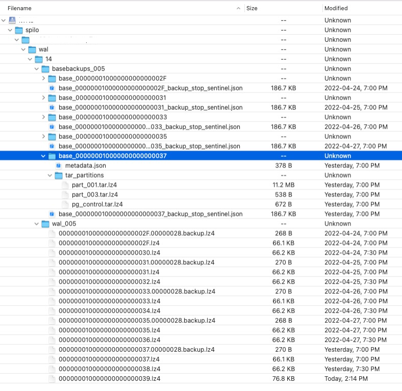

# Restore

The process of rescovering the spilo postgresql cluster from the continuous archived files store on S3 storage

## Process

Make sure there are no connections to the database cluster.

### Stop Patroni failover and shutdown Postgresql database

1. On the leader pod, disable the failover 
```
$ patronictl pause [patroni cluster name]
```
2. On the the secondary pods, stop the  postgresql databse
```
$ pg_ctl stop
```

3. On leader pod, stop the postgresql databse by running the same command as above

4. Make sure all pods are stopped and maintenance mode is on
```
$ patronictl list
```

### Retrieve the latest base backup

Retrieve the latest base backup and all archieved WAL files.

1. On the leader pod, fetch the latest backup from S3 Object Storage
```
$ envdir /run/etc/wal-e.d/env wal-g backup-fetch /home/postgres/pgdata/pgroot/latest-backup LATEST
It copies the latest base backup base_0000..0037 according to the sample below.
```

 
2. Rename data folder to data-ori and rename latest-backup to data
```
$ cd /home/postgres/pgdata/pgroot
$ mv data data-ori
$ mv latest-backup data
```

3. Download, unzip and copy the files under wal_005 folder to /home/postgres/pgdata/pgroot/allWALs

4. Copy the files didn't had a chance to be archieved  
Compare the files under /home/postgres/pgdata/pgroot/data-ori/pg_wal and the filder under wal_005 folder and copy the additional files to /home/postgres/pgdata/pgroot/allWALs if there are any
```
According to the sample, the final files in allWALs folder should be
000000010000000000000037.00000028.backup -- from S3 storage
000000010000000000000037 -- from S3 storage
000000010000000000000038 -- from S3 storage
000000010000000000000039 -- from S3 storage
000000010000000000000040 -- from data-ori/pg_wal
```

### Restore

1. Create recovery.signal file
```
$ touch /home/postgres/pgdata/pgroot/data/recovery.signal
```

2. Add the recovery command to postgresql.conf
```
restore_command = 'cp /home/postgres/pgdata/pgroot/allWALs/%f "%p"'
```

3. Start the postgresql on the leader pod
```
$ pg_ctl start
The file recovery.signal will be removed
```

4. Start the postgresql on the secondary pods

5. Run patronistl list, the maintenance mond is still on

6. Resume the patroni cluster on the leader pod
```
$ patronictl resume
```
Now the patroni cluster is fully restored, login to the database to verify the laest changes
The restore_command=.. in postgresql.conf is removed automatically.


